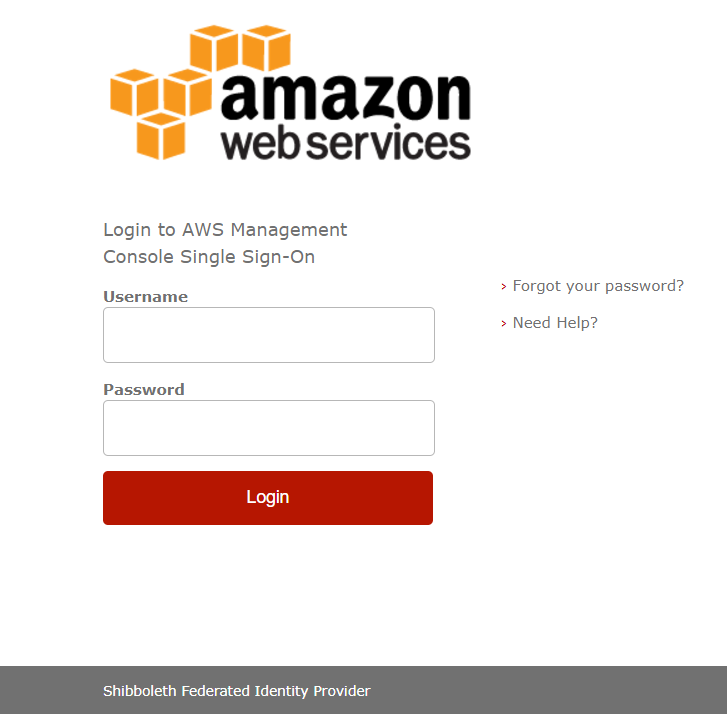
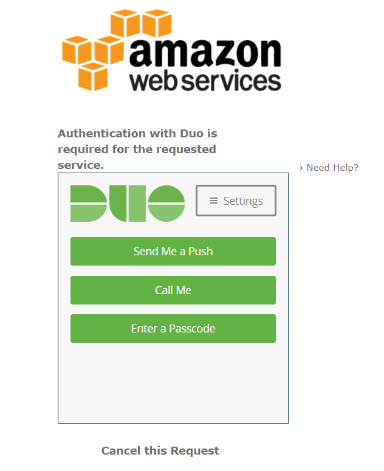

# shibboleth3-aws-duo-config
This project is to help to deploy a Shibboleth IdP for SAML Federation and Single Sign-On (SSO) to AWS with Duo two-factor MFA enabled. 

### Login Screen (with your AD credentials)

### Duo 2nd Authentication Factor

Once you have a working Shibboleth you can use this other project I've been working on to access the AWS CLI via the IdP with the 2nd factor as well - https://github.com/jasonumiker/samlapi

## Usage
There are three methods I've documented or automated so far:
1. You can install the package on a Windows server and then manually modify the configuration files as described in the manual_config_windows folder. This config should mostly work on Linux as well but the paths are slightly different there.
1. You can use the scripts and configuration files in docker_conf-in-img project to build a Linux Docker image with all the configs required embedded in the image.
1. You can externalise the configuration and secrets to S3 and Parameter store and build a container that will pull them at runtime by using docker_conf-in-s3.

**WARNING**: The in-image Dockerized config includes the secrets so you need to either do this build locally on the machine that will run the container/service or secure the pulling of the image to trusted individuals. The private keys in this config can be exploited to get extensive AWS access if leaked. These keys will also be in the customized-shibboleth-idp folder that is part of the build process on the server that did the build so clean them up afterward if required for safety.

## Assumptions
1. I have tried this against both the Simple AD and a MS AD versions of the AWS Directory Service. It should work against any AD server via LDAP but I have not tested against a self-managed AD server on EC2.
    1. Using LDAP rather than LDAPS over unsecured networks is problematic but doing it within the same VPC especially if access is restricted to between the Shibboleth and AD via security groups should be fine.
        1. Not to mention that for reliability reasons there should be a replica of your directory within the AWS VPC(s) near the Shibbolth IdP anyway.
1. I leveraged the built-in Duo MFA plugin in the Shibboleth so the assumption is that you want to leverage Duo at the moment. They do support other MFA types via plugins and I have not yet explored that.
1. The default configuration for Shibboleth allows for High(ish) Availability by storing nearly everything on the client browser side as described here - https://wiki.shibboleth.net/confluence/display/IDP30/Clustering#Clustering-DefaultIdPConfiguration. So you can have multiple IdPs behind a LB and it works.
    1. The one issue with the default configuration is that during the login process some of the flow state is on a node so they encourage a little stickiness on the load balancer side such that a client's login will complete on the same node that it started on. I have enabled stickiness on my ALB to facilitate this. More on this here - https://wiki.shibboleth.net/confluence/display/IDP30/Clustering#Clustering-ConversationalState.

## Future plans
Things to come for this project include:
1. Support for more MFA plugins/types including at least Google Authenticator or opting-out of MFA to just use Passwords if you want
1. CloudFormation templates to roll this out including one for setting up EC2 instances to run this container and another for Deploying it to ECS
1. Set up the IdP to externalise its state to an RDS or ElastiCache to remove the need for ALB stickiness
